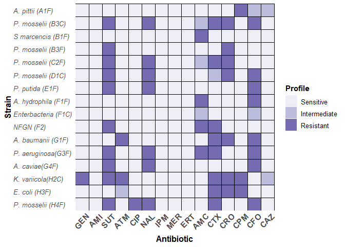

heatmap\_atb
================

# Set library

``` r
library(ggplot2)
```

``` r
library(readxl)
```

# Set data

``` r
ATB <- read_excel('heatmap_ATB.xlsx')
ATB <- data.frame(ATB)
ATB
```

    ##     Local              Strain Order1 Antibiotic Order2      Profile Order34
    ## 1    A1-F     A. pittii (A1F)     16        GEN      1    Sensitive       1
    ## 2    A1-F     A. pittii (A1F)     16        AMI      2    Sensitive       1
    ## 3    A1-F     A. pittii (A1F)     16        SUT      3    Sensitive       1
    ## 4    A1-F     A. pittii (A1F)     16        ATM      4    Sensitive       1
    ## 5    A1-F     A. pittii (A1F)     16        CIP      5    Sensitive       1
    ## 6    A1-F     A. pittii (A1F)     16        NAL      6    Sensitive       1
    ## 7    A1-F     A. pittii (A1F)     16        IPM      7    Sensitive       1
    ## 8    A1-F     A. pittii (A1F)     16        MER      8    Sensitive       1
    ## 9    A1-F     A. pittii (A1F)     16        ERT      9    Sensitive       1
    ## 10   A1-F     A. pittii (A1F)     16        AMC     10    Sensitive       1
    ## 11   A1-F     A. pittii (A1F)     16        CTX     11    Sensitive       1
    ## 12   A1-F     A. pittii (A1F)     16        CRO     12    Sensitive       1
    ## 13   A1-F     A. pittii (A1F)     16        CPM     13    Resistant       3
    ## 14   A1-F     A. pittii (A1F)     16        CFO     14 Intermediate       2
    ## 15   A1-F     A. pittii (A1F)     16        CAZ     15 Intermediate       2
    ## 16   B3-C   P. mosselii (B3C)     15        GEN      1    Sensitive       1
    ## 17   B3-C   P. mosselii (B3C)     15        AMI      2    Sensitive       1
    ## 18   B3-C   P. mosselii (B3C)     15        SUT      3    Resistant       3
    ## 19   B3-C   P. mosselii (B3C)     15        ATM      4    Sensitive       1
    ## 20   B3-C   P. mosselii (B3C)     15        CIP      5    Sensitive       1
    ## 21   B3-C   P. mosselii (B3C)     15        NAL      6    Resistant       3
    ## 22   B3-C   P. mosselii (B3C)     15        IPM      7    Sensitive       1
    ## 23   B3-C   P. mosselii (B3C)     15        MER      8    Sensitive       1
    ## 24   B3-C   P. mosselii (B3C)     15        ERT      9    Sensitive       1
    ## 25   B3-C   P. mosselii (B3C)     15        AMC     10 Intermediate       2
    ## 26   B3-C   P. mosselii (B3C)     15        CTX     11    Resistant       3
    ## 27   B3-C   P. mosselii (B3C)     15        CRO     12    Resistant       3
    ## 28   B3-C   P. mosselii (B3C)     15        CPM     13    Sensitive       1
    ## 29   B3-C   P. mosselii (B3C)     15        CFO     14    Resistant       3
    ## 30   B3-C   P. mosselii (B3C)     15        CAZ     15    Sensitive       1
    ## 31   B1-F   S marcencis (B1F)     14        GEN      1    Sensitive       1
    ## 32   B1-F   S marcencis (B1F)     14        AMI      2    Sensitive       1
    ## 33   B1-F   S marcencis (B1F)     14        SUT      3    Sensitive       1
    ## 34   B1-F   S marcencis (B1F)     14        ATM      4    Sensitive       1
    ## 35   B1-F   S marcencis (B1F)     14        CIP      5    Sensitive       1
    ## 36   B1-F   S marcencis (B1F)     14        NAL      6    Sensitive       1
    ## 37   B1-F   S marcencis (B1F)     14        IPM      7    Sensitive       1
    ## 38   B1-F   S marcencis (B1F)     14        MER      8    Sensitive       1
    ## 39   B1-F   S marcencis (B1F)     14        ERT      9    Sensitive       1
    ## 40   B1-F   S marcencis (B1F)     14        AMC     10    Resistant       3
    ## 41   B1-F   S marcencis (B1F)     14        CTX     11    Sensitive       1
    ## 42   B1-F   S marcencis (B1F)     14        CRO     12    Sensitive       1
    ## 43   B1-F   S marcencis (B1F)     14        CPM     13    Sensitive       1
    ## 44   B1-F   S marcencis (B1F)     14        CFO     14    Sensitive       1
    ## 45   B1-F   S marcencis (B1F)     14        CAZ     15    Sensitive       1
    ## 46   B3-F   P. mosselii (B3F)     13        GEN      1    Sensitive       1
    ## 47   B3-F   P. mosselii (B3F)     13        AMI      2    Sensitive       1
    ## 48   B3-F   P. mosselii (B3F)     13        SUT      3    Resistant       3
    ## 49   B3-F   P. mosselii (B3F)     13        ATM      4    Sensitive       1
    ## 50   B3-F   P. mosselii (B3F)     13        CIP      5    Sensitive       1
    ## 51   B3-F   P. mosselii (B3F)     13        NAL      6    Sensitive       1
    ## 52   B3-F   P. mosselii (B3F)     13        IPM      7    Sensitive       1
    ## 53   B3-F   P. mosselii (B3F)     13        MER      8    Sensitive       1
    ## 54   B3-F   P. mosselii (B3F)     13        ERT      9    Sensitive       1
    ## 55   B3-F   P. mosselii (B3F)     13        AMC     10    Sensitive       1
    ## 56   B3-F   P. mosselii (B3F)     13        CTX     11    Sensitive       1
    ## 57   B3-F   P. mosselii (B3F)     13        CRO     12    Resistant       3
    ## 58   B3-F   P. mosselii (B3F)     13        CPM     13    Sensitive       1
    ## 59   B3-F   P. mosselii (B3F)     13        CFO     14    Sensitive       1
    ## 60   B3-F   P. mosselii (B3F)     13        CAZ     15    Sensitive       1
    ## 61   C2-F   P. mosselii (C2F)     12        GEN      1    Sensitive       1
    ## 62   C2-F   P. mosselii (C2F)     12        AMI      2    Sensitive       1
    ## 63   C2-F   P. mosselii (C2F)     12        SUT      3    Resistant       3
    ## 64   C2-F   P. mosselii (C2F)     12        ATM      4    Sensitive       1
    ## 65   C2-F   P. mosselii (C2F)     12        CIP      5    Sensitive       1
    ## 66   C2-F   P. mosselii (C2F)     12        NAL      6    Resistant       3
    ## 67   C2-F   P. mosselii (C2F)     12        IPM      7    Sensitive       1
    ## 68   C2-F   P. mosselii (C2F)     12        MER      8    Sensitive       1
    ## 69   C2-F   P. mosselii (C2F)     12        ERT      9    Sensitive       1
    ## 70   C2-F   P. mosselii (C2F)     12        AMC     10 Intermediate       2
    ## 71   C2-F   P. mosselii (C2F)     12        CTX     11    Resistant       3
    ## 72   C2-F   P. mosselii (C2F)     12        CRO     12    Resistant       3
    ## 73   C2-F   P. mosselii (C2F)     12        CPM     13    Sensitive       1
    ## 74   C2-F   P. mosselii (C2F)     12        CFO     14    Sensitive       1
    ## 75   C2-F   P. mosselii (C2F)     12        CAZ     15    Sensitive       1
    ## 76   D1-C   P. mosselii (D1C)     11        GEN      1    Sensitive       1
    ## 77   D1-C   P. mosselii (D1C)     11        AMI      2    Sensitive       1
    ## 78   D1-C   P. mosselii (D1C)     11        SUT      3    Resistant       3
    ## 79   D1-C   P. mosselii (D1C)     11        ATM      4    Sensitive       1
    ## 80   D1-C   P. mosselii (D1C)     11        CIP      5    Sensitive       1
    ## 81   D1-C   P. mosselii (D1C)     11        NAL      6    Resistant       3
    ## 82   D1-C   P. mosselii (D1C)     11        IPM      7    Sensitive       1
    ## 83   D1-C   P. mosselii (D1C)     11        MER      8    Sensitive       1
    ## 84   D1-C   P. mosselii (D1C)     11        ERT      9    Sensitive       1
    ## 85   D1-C   P. mosselii (D1C)     11        AMC     10    Sensitive       1
    ## 86   D1-C   P. mosselii (D1C)     11        CTX     11 Intermediate       2
    ## 87   D1-C   P. mosselii (D1C)     11        CRO     12    Resistant       3
    ## 88   D1-C   P. mosselii (D1C)     11        CPM     13    Sensitive       1
    ## 89   D1-C   P. mosselii (D1C)     11        CFO     14    Resistant       3
    ## 90   D1-C   P. mosselii (D1C)     11        CAZ     15    Sensitive       1
    ## 91   E1-F     P. putida (E1F)     10        GEN      1    Sensitive       1
    ## 92   E1-F     P. putida (E1F)     10        AMI      2    Sensitive       1
    ## 93   E1-F     P. putida (E1F)     10        SUT      3    Resistant       3
    ## 94   E1-F     P. putida (E1F)     10        ATM      4    Sensitive       1
    ## 95   E1-F     P. putida (E1F)     10        CIP      5    Sensitive       1
    ## 96   E1-F     P. putida (E1F)     10        NAL      6    Resistant       3
    ## 97   E1-F     P. putida (E1F)     10        IPM      7    Sensitive       1
    ## 98   E1-F     P. putida (E1F)     10        MER      8    Sensitive       1
    ## 99   E1-F     P. putida (E1F)     10        ERT      9    Sensitive       1
    ## 100  E1-F     P. putida (E1F)     10        AMC     10    Sensitive       1
    ## 101  E1-F     P. putida (E1F)     10        CTX     11    Sensitive       1
    ## 102  E1-F     P. putida (E1F)     10        CRO     12    Sensitive       1
    ## 103  E1-F     P. putida (E1F)     10        CPM     13    Sensitive       1
    ## 104  E1-F     P. putida (E1F)     10        CFO     14    Resistant       3
    ## 105  E1-F     P. putida (E1F)     10        CAZ     15    Sensitive       1
    ## 106  F1-F A. hydrophila (F1F)      9        GEN      1    Sensitive       1
    ## 107  F1-F A. hydrophila (F1F)      9        AMI      2    Sensitive       1
    ## 108  F1-F A. hydrophila (F1F)      9        SUT      3    Sensitive       1
    ## 109  F1-F A. hydrophila (F1F)      9        ATM      4    Sensitive       1
    ## 110  F1-F A. hydrophila (F1F)      9        CIP      5    Sensitive       1
    ## 111  F1-F A. hydrophila (F1F)      9        NAL      6    Sensitive       1
    ## 112  F1-F A. hydrophila (F1F)      9        IPM      7    Sensitive       1
    ## 113  F1-F A. hydrophila (F1F)      9        MER      8    Sensitive       1
    ## 114  F1-F A. hydrophila (F1F)      9        ERT      9    Sensitive       1
    ## 115  F1-F A. hydrophila (F1F)      9        AMC     10    Resistant       3
    ## 116  F1-F A. hydrophila (F1F)      9        CTX     11    Sensitive       1
    ## 117  F1-F A. hydrophila (F1F)      9        CRO     12    Sensitive       1
    ## 118  F1-F A. hydrophila (F1F)      9        CPM     13    Sensitive       1
    ## 119  F1-F A. hydrophila (F1F)      9        CFO     14    Resistant       3
    ## 120  F1-F A. hydrophila (F1F)      9        CAZ     15    Sensitive       1
    ## 121  F1-C Enterbacteria (F1C)      8        GEN      1    Sensitive       1
    ## 122  F1-C Enterbacteria (F1C)      8        AMI      2    Sensitive       1
    ## 123  F1-C Enterbacteria (F1C)      8        SUT      3    Sensitive       1
    ## 124  F1-C Enterbacteria (F1C)      8        ATM      4    Sensitive       1
    ## 125  F1-C Enterbacteria (F1C)      8        CIP      5    Sensitive       1
    ## 126  F1-C Enterbacteria (F1C)      8        NAL      6    Sensitive       1
    ## 127  F1-C Enterbacteria (F1C)      8        IPM      7    Sensitive       1
    ## 128  F1-C Enterbacteria (F1C)      8        MER      8    Sensitive       1
    ## 129  F1-C Enterbacteria (F1C)      8        ERT      9    Sensitive       1
    ## 130  F1-C Enterbacteria (F1C)      8        AMC     10 Intermediate       2
    ## 131  F1-C Enterbacteria (F1C)      8        CTX     11    Sensitive       1
    ## 132  F1-C Enterbacteria (F1C)      8        CRO     12    Sensitive       1
    ## 133  F1-C Enterbacteria (F1C)      8        CPM     13    Sensitive       1
    ## 134  F1-C Enterbacteria (F1C)      8        CFO     14 Intermediate       2
    ## 135  F1-C Enterbacteria (F1C)      8        CAZ     15    Sensitive       1
    ## 136    F2           NFGN (F2)      7        GEN      1    Sensitive       1
    ## 137    F2           NFGN (F2)      7        AMI      2    Sensitive       1
    ## 138    F2           NFGN (F2)      7        SUT      3    Resistant       3
    ## 139    F2           NFGN (F2)      7        ATM      4    Sensitive       1
    ## 140    F2           NFGN (F2)      7        CIP      5    Sensitive       1
    ## 141    F2           NFGN (F2)      7        NAL      6    Sensitive       1
    ## 142    F2           NFGN (F2)      7        IPM      7    Sensitive       1
    ## 143    F2           NFGN (F2)      7        MER      8    Sensitive       1
    ## 144    F2           NFGN (F2)      7        ERT      9    Sensitive       1
    ## 145    F2           NFGN (F2)      7        AMC     10    Resistant       3
    ## 146    F2           NFGN (F2)      7        CTX     11    Resistant       3
    ## 147    F2           NFGN (F2)      7        CRO     12    Sensitive       1
    ## 148    F2           NFGN (F2)      7        CPM     13    Sensitive       1
    ## 149    F2           NFGN (F2)      7        CFO     14    Sensitive       1
    ## 150    F2           NFGN (F2)      7        CAZ     15    Sensitive       1
    ## 151  G1-C   A. baumanii (G1F)      6        GEN      1    Sensitive       1
    ## 152  G1-C   A. baumanii (G1F)      6        AMI      2    Sensitive       1
    ## 153  G1-C   A. baumanii (G1F)      6        SUT      3    Sensitive       1
    ## 154  G1-C   A. baumanii (G1F)      6        ATM      4    Resistant       3
    ## 155  G1-C   A. baumanii (G1F)      6        CIP      5    Sensitive       1
    ## 156  G1-C   A. baumanii (G1F)      6        NAL      6    Sensitive       1
    ## 157  G1-C   A. baumanii (G1F)      6        IPM      7    Sensitive       1
    ## 158  G1-C   A. baumanii (G1F)      6        MER      8    Sensitive       1
    ## 159  G1-C   A. baumanii (G1F)      6        ERT      9    Sensitive       1
    ## 160  G1-C   A. baumanii (G1F)      6        AMC     10    Sensitive       1
    ## 161  G1-C   A. baumanii (G1F)      6        CTX     11    Resistant       3
    ## 162  G1-C   A. baumanii (G1F)      6        CRO     12    Resistant       3
    ## 163  G1-C   A. baumanii (G1F)      6        CPM     13    Sensitive       1
    ## 164  G1-C   A. baumanii (G1F)      6        CFO     14    Resistant       3
    ## 165  G1-C   A. baumanii (G1F)      6        CAZ     15    Sensitive       1
    ## 166  G3-F  P. aeruginosa(G3F)      5        GEN      1    Sensitive       1
    ## 167  G3-F  P. aeruginosa(G3F)      5        AMI      2    Sensitive       1
    ## 168  G3-F  P. aeruginosa(G3F)      5        SUT      3    Resistant       3
    ## 169  G3-F  P. aeruginosa(G3F)      5        ATM      4    Sensitive       1
    ## 170  G3-F  P. aeruginosa(G3F)      5        CIP      5    Sensitive       1
    ## 171  G3-F  P. aeruginosa(G3F)      5        NAL      6    Resistant       3
    ## 172  G3-F  P. aeruginosa(G3F)      5        IPM      7    Sensitive       1
    ## 173  G3-F  P. aeruginosa(G3F)      5        MER      8    Sensitive       1
    ## 174  G3-F  P. aeruginosa(G3F)      5        ERT      9    Sensitive       1
    ## 175  G3-F  P. aeruginosa(G3F)      5        AMC     10    Resistant       3
    ## 176  G3-F  P. aeruginosa(G3F)      5        CTX     11    Resistant       3
    ## 177  G3-F  P. aeruginosa(G3F)      5        CRO     12    Sensitive       1
    ## 178  G3-F  P. aeruginosa(G3F)      5        CPM     13    Sensitive       1
    ## 179  G3-F  P. aeruginosa(G3F)      5        CFO     14    Resistant       3
    ## 180  G3-F  P. aeruginosa(G3F)      5        CAZ     15    Sensitive       1
    ## 181  G4-F      A. caviae(G4F)      4        GEN      1    Sensitive       1
    ## 182  G4-F      A. caviae(G4F)      4        AMI      2    Sensitive       1
    ## 183  G4-F      A. caviae(G4F)      4        SUT      3    Resistant       3
    ## 184  G4-F      A. caviae(G4F)      4        ATM      4    Sensitive       1
    ## 185  G4-F      A. caviae(G4F)      4        CIP      5    Sensitive       1
    ## 186  G4-F      A. caviae(G4F)      4        NAL      6    Resistant       3
    ## 187  G4-F      A. caviae(G4F)      4        IPM      7    Sensitive       1
    ## 188  G4-F      A. caviae(G4F)      4        MER      8    Sensitive       1
    ## 189  G4-F      A. caviae(G4F)      4        ERT      9    Sensitive       1
    ## 190  G4-F      A. caviae(G4F)      4        AMC     10    Sensitive       1
    ## 191  G4-F      A. caviae(G4F)      4        CTX     11    Sensitive       1
    ## 192  G4-F      A. caviae(G4F)      4        CRO     12    Sensitive       1
    ## 193  G4-F      A. caviae(G4F)      4        CPM     13    Sensitive       1
    ## 194  G4-F      A. caviae(G4F)      4        CFO     14    Resistant       3
    ## 195  G4-F      A. caviae(G4F)      4        CAZ     15    Sensitive       1
    ## 196  H2-C   K. variicola(H2C)      3        GEN      1    Resistant       3
    ## 197  H2-C   K. variicola(H2C)      3        AMI      2    Sensitive       1
    ## 198  H2-C   K. variicola(H2C)      3        SUT      3    Resistant       3
    ## 199  H2-C   K. variicola(H2C)      3        ATM      4    Resistant       3
    ## 200  H2-C   K. variicola(H2C)      3        CIP      5    Sensitive       1
    ## 201  H2-C   K. variicola(H2C)      3        NAL      6    Sensitive       1
    ## 202  H2-C   K. variicola(H2C)      3        IPM      7    Sensitive       1
    ## 203  H2-C   K. variicola(H2C)      3        MER      8    Sensitive       1
    ## 204  H2-C   K. variicola(H2C)      3        ERT      9    Sensitive       1
    ## 205  H2-C   K. variicola(H2C)      3        AMC     10    Sensitive       1
    ## 206  H2-C   K. variicola(H2C)      3        CTX     11    Resistant       3
    ## 207  H2-C   K. variicola(H2C)      3        CRO     12    Resistant       3
    ## 208  H2-C   K. variicola(H2C)      3        CPM     13    Resistant       3
    ## 209  H2-C   K. variicola(H2C)      3        CFO     14    Sensitive       1
    ## 210  H2-C   K. variicola(H2C)      3        CAZ     15 Intermediate       2
    ## 211  H3-F       E. coli (H3F)      2        GEN      1    Sensitive       1
    ## 212  H3-F       E. coli (H3F)      2        AMI      2    Sensitive       1
    ## 213  H3-F       E. coli (H3F)      2        SUT      3    Sensitive       1
    ## 214  H3-F       E. coli (H3F)      2        ATM      4 Intermediate       2
    ## 215  H3-F       E. coli (H3F)      2        CIP      5    Sensitive       1
    ## 216  H3-F       E. coli (H3F)      2        NAL      6    Sensitive       1
    ## 217  H3-F       E. coli (H3F)      2        IPM      7    Sensitive       1
    ## 218  H3-F       E. coli (H3F)      2        MER      8    Sensitive       1
    ## 219  H3-F       E. coli (H3F)      2        ERT      9    Sensitive       1
    ## 220  H3-F       E. coli (H3F)      2        AMC     10    Sensitive       1
    ## 221  H3-F       E. coli (H3F)      2        CTX     11    Resistant       3
    ## 222  H3-F       E. coli (H3F)      2        CRO     12    Resistant       3
    ## 223  H3-F       E. coli (H3F)      2        CPM     13    Resistant       3
    ## 224  H3-F       E. coli (H3F)      2        CFO     14    Sensitive       1
    ## 225  H3-F       E. coli (H3F)      2        CAZ     15    Sensitive       1
    ## 226  H4-F   P. mosselii (H4F)      1        GEN      1    Sensitive       1
    ## 227  H4-F   P. mosselii (H4F)      1        AMI      2    Sensitive       1
    ## 228  H4-F   P. mosselii (H4F)      1        SUT      3    Resistant       3
    ## 229  H4-F   P. mosselii (H4F)      1        ATM      4    Sensitive       1
    ## 230  H4-F   P. mosselii (H4F)      1        CIP      5    Resistant       3
    ## 231  H4-F   P. mosselii (H4F)      1        NAL      6    Resistant       3
    ## 232  H4-F   P. mosselii (H4F)      1        IPM      7    Sensitive       1
    ## 233  H4-F   P. mosselii (H4F)      1        MER      8    Sensitive       1
    ## 234  H4-F   P. mosselii (H4F)      1        ERT      9    Sensitive       1
    ## 235  H4-F   P. mosselii (H4F)      1        AMC     10    Sensitive       1
    ## 236  H4-F   P. mosselii (H4F)      1        CTX     11    Resistant       3
    ## 237  H4-F   P. mosselii (H4F)      1        CRO     12    Sensitive       1
    ## 238  H4-F   P. mosselii (H4F)      1        CPM     13    Sensitive       1
    ## 239  H4-F   P. mosselii (H4F)      1        CFO     14    Resistant       3
    ## 240  H4-F   P. mosselii (H4F)      1        CAZ     15    Sensitive       1

# Reorder variables

``` r
ATB$Strain <- reorder(ATB$Strain, ATB$Order1)
ATB$Antibiotic<-reorder(ATB$Antibiotic, ATB$Order2)
ATB$Profile <- reorder(ATB$Profile, ATB$Order34)
```

# Making heatmap

``` r
p<-ggplot(ATB, aes(x=Antibiotic, y=Strain, fill=Profile))  
p + geom_tile() + 
  scale_color_brewer(type = 'seq', palette = 12, direction = 1, aesthetics = 'fill') +
  scale_x_discrete(expand = c(0, 0)) +  scale_y_discrete(expand = c(0,0)) +
  geom_vline(xintercept=seq(1.5, length(ATB$Profile))) + 
  geom_hline(yintercept=seq(1.5, length(ATB$Profile)))+  
  theme(
    axis.line = element_blank(),
    axis.ticks = element_blank(),
    panel.background = element_blank(),
    axis.title.x = element_text(angle=360, size=12, hjust=0.5, face = 'bold'),
    axis.title.y = element_text(angle=90, size=12, hjust=0.5, face = 'bold'),
    axis.text.x = element_text(angle=45, size=12, hjust=0.8, face = 'bold'),
    axis.text.y = element_text(face = 'italic', hjust = 0, size = 10),
    legend.title = element_text(face ='bold'),
    legend.text = element_text(size = 10))
```

<!-- -->

# Saving heatmap

``` r
ggsave(filename = 'atb_profile.tiff', device = "tiff" , height = 5, width = 8, dpi = 400, path = 'C:/Users/Natalia/Dropbox/Pesquisas/artigos para revistas/Resistencia_doutorado/paper grande/')
```
